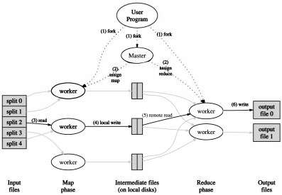

---
linkcolor: red
urlcolor: purple
citecolor: blue
...

# G-3

## [Websearch for a Planet: The Google Cluster Architecture](http://www.eecs.harvard.edu/~dbrooks/cs246-fall2004/google.pdf)

Google’s architecture features clusters of more than 15,000 **commodity** class PCs with fault-tolerant software. This architecture achieves superior performance at a fraction of the cost of a system built from fewer, but more expensive, high-end servers.

**Energy efficiency and price-performance** ratio are the most important factors which influence the design.
For energy efficiency, power consumption and cooling issues are taxing the limits of available data center power densities. Google is an example of a **throughput-oriented, parallel friendly** workload.

Reliability is provided in **software** rather than in server-class hardware, and **aggregate request throughput** rather than peak server response time are tailored for design.

To provide sufficient capacity to handle query traffic, google service consists of multiple clusters distributed worldwide.
Each cluster has around a few thousand machines, and the geographically distributed setup protects us against catastrophic data center failures.
A DNS-based load-balancing system selects a cluster by accounting for the user’s geographic proximity to each physical cluster.
Processing of each request is entirely local to that cluster, and there is load balancer to dispatch the request to one of the Google Web Servers(GWS).

First phase of the processing the query is to consult the inverted index that maps each query word to a matching list of documents and then the relevance score is computed. The inverted index is sharded by dividing the documents.

Second phase is to take the list of docids and computing the actual title and uniform resource locator of thse documents. Also, the documents is distributed randomly to smaller shards and there is a load balancer.

Most access to the inex and other data structures involved in answering a query are read-only, and updates are relatively infrequest.

Machines older than three years are so much slower than current-generation machines that it is difficult to achieve proper load distribution and configuration in clusters containing both types.

There is **not** that much exploitable instruction-level parallelism in the workload.
Measurements suggest that the level of aggressive out-of-order, speculative execution present in modern processors is already beyond the point of diminishing performance returns for such programs.

- Google使用很多廉价服务器组成集群来提供服务
    - 架构设计的考量中最重要的是**能效、性价比**
    - Google搜索是一种典型的**吞吐敏感、易于并行**的服务
    - 不使用更贵的企业级硬件，可靠性由软件层保证
    - 不极致优化单个请求延迟，优化目标是总吞吐量
- 一个搜索请求
    - 多个集群遍布全球，根据DNS给某个集群
    - 集群内部使单个GWS负载均衡
    - 倒排索引分片，靠随机划分文档集
    - 每个分片由一个集群提供服务，同样有负载均衡分发给某台机器
    - 靠文档ID去拿真正的文档标题等，同样划分-分片-负载均衡
- 多副本提高服务能力和可用性
    - 绝大多数请求链路只读
    - 灰度更新索引，不保证一致性
- 线上机器通常不会超过3年
- 指令级并行对提升性能没太大帮助

## [MapReduce: Simplified Data Processing on Large Clusters](https://www.usenix.org/legacy/events/osdi04/tech/full_papers/dean/dean.pdf)

OSDI 2004.

MapReduce is a programming model and an associated implementation for processing and generating large dataset.
Many real world tasks are expressible in this model.

- *map* function is to process a key/value pair to generate a set of intermediate key/value pairs.
- *reduce* merges all intermediate values associated with the same intermediate key.

The run-time system takes care of the details of partitioning the input data, scheduling the program's execution across a set of machines, handling machine failures and managing the required inter-machine communication.

The abstraction is inspired by the *map* and *reduce* primitives present in Lisp and many other functioinal languages.

### Programming Model

```go
// pseudo-code of counting the number of occurrences of each word in a large collection of document

func Map(key string, value string) {
    // key: document name
    // value: document
    for _, word := range(strings.Split(value, " ")) {
        EmitIntermediate(word, "1");
    }
}

func Reduce(key string, values []string) {
    // key: a word
    // values: a slice of counts
    result := 0
    for _, cnt := values {
        result += ParseInt(cnt)
    }
    Emit(AsString(result))
}
```

### Implementation



The right choice of MapReduce implementation depends on the environment.

1. Split the input files into M pieces of typically 16-64 megabytes. And then drop them to GFS.
1. There are M map tasks and R reduce tasks.
1. A worker who is assigned a map task reads the contents, and it parses and passes each pair to Map function. The intermediate key/value pairs are buffered in memory.
1. Periodically, buffered pairs are written to local disk, which partitioned into R regions by the partitioning function.
1. Reduce worker reads the intermediate data, and it sorts it by the intermediate keys.
1. For each unique key encountered, it passes the key and the corresponding set of intermediate values to the user's Reduce function. The output is to append to the final output file for this reduce partition.
1. When all map tasks and reduce tasks have been completed, the MapReduce job finished.

#### Fault Tolerance

worker:

1. heart beat to check whether worker lives
1. reduce worker renames its temporary output file to final output file **atomically**
1. re-excuted produces the same output; map tasks are re-executed, but reduce tasks not
1. after re-executing one map task, all the reduce workers would be notified

master:

1. simply assume that master will not fail, but write checkpoints periodically

#### Backup Tasks

When a MapReduce opeartion is close to completion, the master schedules backup executions of the remaining *in-progress* tasks.

### Refinements

TODO

- MapReduce要求map, reduce均无后效性
- 无后效性的函数只需重复执行即可，错误处理变得异常简单

## [Bigtable: A Distributed Storage System for Structured Data](http://static.usenix.org/event/osdi06/tech/chang/chang.pdf)

OSDI 2006.

## [The Google file system](https://static.googleusercontent.com/media/research.google.com/en//archive/gfs-sosp2003.pdf)

SOSP 2003.

Traditional choices are reexamined and different points of design space are explored radically.

1. Component failures are the norm rather than the exception.
1. Files are huge by traditional standards as multi GB files are common.
1. Most files are mutated by appending new data rather than overwriting existing data.
1. Co-designing the applications and the file system API benefits the overall system.

GFS provides a familiar file system interface but it does not implement fully a standard API.
GFS support the usual operations like `create`, `delete`, `open`, `close`, `read` and `write`. Moreover, GFS has `snapshot` and `record append` operations.

A GFS cluster consists of a single *master* and multiple *chunkservers* and is accessed by multiple *clients*.

Files are divided to fixed-size *chunks*. Each chunk is identified by an immutable, globaly unique 64bit *chunk handle* assigned by *master* at the creation.
For reliability, each chunk is replicated on multiple chunkservers. By default, three replicas are stored.

The master maintains all file system metadata.

Size of chunk is 64MB, and each chunk replica is stored as plain Linux file on a chunkserver.

The master stores three major types of metadata:

1. file and chunk namespaces
1. mapping from files to chunks
1. locations of each chunk's location

<!-- Guarantees: -->

<!-- - File namespace mutations (e.g., file creation) are atomic. -->
<!-- - The state of a file region after a data mutation depends on the type of mutation, whether it succeeds or fails, and whether there are concurrent mutations. -->

Q:

- `record append`?

# 分布式存储

## [Ceph: A Scalable, High-Performance Distributed File System](https://www.usenix.org/legacy/event/osdi06/tech/full_papers/weil/weil.pdf)

2006 OSDI.

## [Spanner: Google’s globally distributed database](https://dl.acm.org/ft_gateway.cfm?id=2491245&type=pdf)

OSDI 2012.

## [PolarFS: An Ultra-low Latency and Failure Resilient Distributed File System for Shared Storage Cloud Database](http://www.vldb.org/pvldb/vol11/p1849-cao.pdf)

VLDB 2018.

Recently, decoupling storage from compute has become a trend for cloud computing industry.

1. Hardware of compute / storage nodes can be different.
2. Disks on different storage nodes can form one pool for fragmentation and storage usage concerns.
3. There is no local persistent state on compute nodes(?), which makes it easier and faster for database migration.

*PolarFS* is designed and implemented to prove a better filesystem comparing to the other common products as there does exist trade-off between consistent and performance.

- Distributed filesystems like HDFS and Ceph are found with much higher latency, and have no use of new hardwares such as RMDA or NVMe.
- General-purpose filesystems like ext4 running on bare metal hardwares are lack of scalability, fault tolerence and usage effciency.

*PolarFS* do use the user space network stack and IO stack.
*PolarFS* proposes *ParallelRaft* as Raft seriously impedes the I/O scalability when using extra low latency hardware.

For NVMe and RDMA, traditional techniques such as kernel space disk drivers or kernel space TCP/IP stack become the bottleneck.

PolarFS has 2 layers:

- Layer 1 is storage layer, which manages all the disk resoures and provides a database volume for every database instance.(Q)
- Layer 2 is filesystem layer, which supports file management and is responsible for mutual exclusion and synchronization of concurrent accesses to file system metadata.

For storage layer:

1. A volumn is allocated for each database instance and is composed of chunks. The capacity of volumns ranges from 10GB to 100TB.
1. Chunks are distributed among ChunkServers, whose relica are placed to three distinct ChunkServers.
1. Size of chunks are 10GB, makes PolarSwitch to store all the metadata in memory possible.
1. A chunk is devided into blocks inside the ChunkServer, and each block is set to 64KB.
1. Large chunk makes seprating hot spot chunk impossible, which means aggregate performance of instances of databases is preferrable to max performance of one instance.

Other components:

1. PolarSwitch is daemon process running in the database server machines (compute nodes) which forwards IO requests to machine where the leader chunk locates according to local cache synchronized with PolarCtrl.
1. Each chunkserver process is bound to a dedicated CPU core and a NVMe SSD. WAL will be first written to a 3D-XPoint SSD buffer.
1. Chunkserver replicates the IO requests and form a consensus group.
1. PolarCtrl is the control plane of a PolarFS cluster, and it is depolyed on at lease 3 dedicated machines.

Q:

- `recv()`
- Layer 1
- WAL

# 分布式锁

## [The Chubby lock service for loosely-coupled distributed systems](http://static.usenix.org/legacy/events/osdi06/tech/full_papers/burrows/burrows.pdf)

# 分布式调度

## [Large-scale cluster management at Google with Borg](https://dl.acm.org/ft_gateway.cfm?ftid=1563633&id=2741964)
