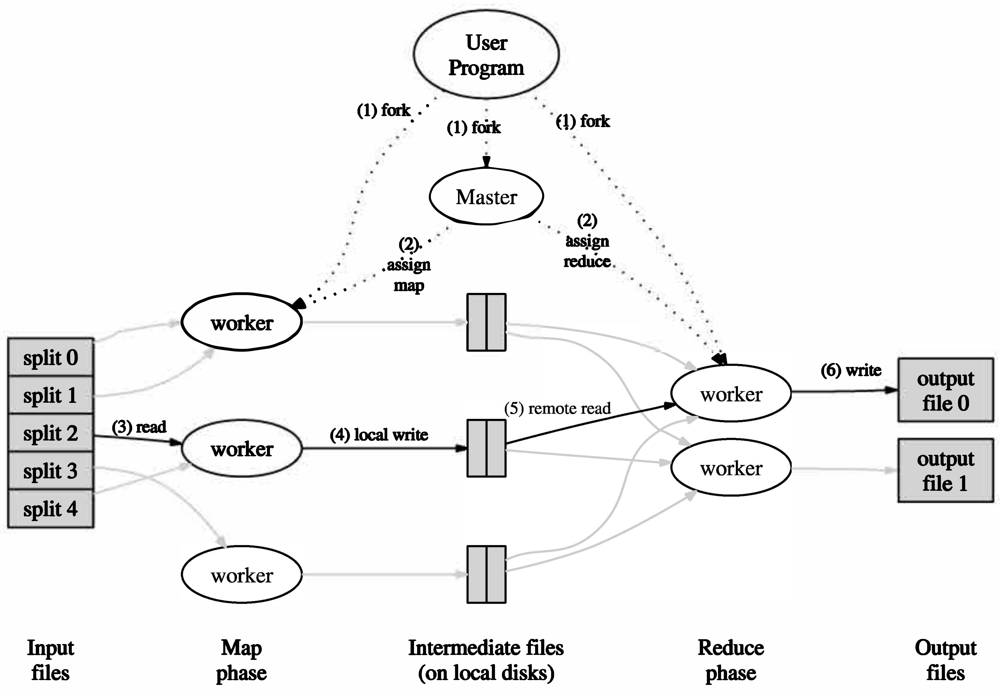
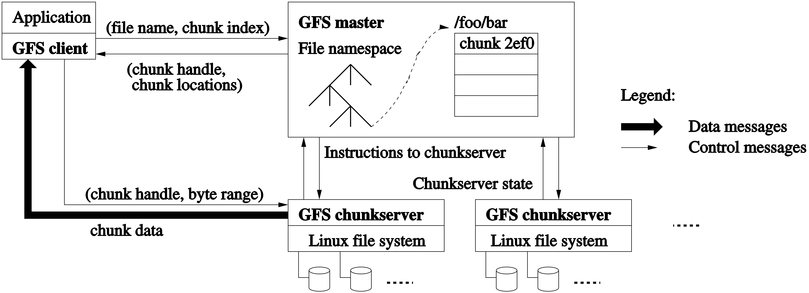
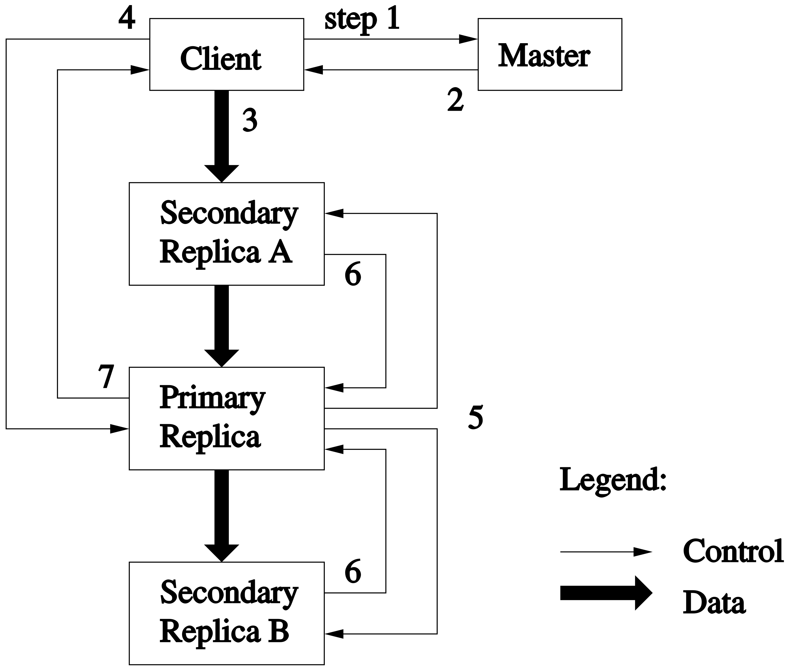
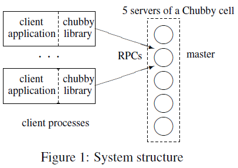

# Google 5

## [Websearch for a Planet: The Google Cluster Architecture](http://www.eecs.harvard.edu/~dbrooks/cs246-fall2004/google.pdf)

Google’s architecture features clusters of more than 15,000 **commodity** class PCs with fault-tolerant software. This architecture achieves superior performance at a fraction of the cost of a system built from fewer, but more expensive, high-end servers.

**Energy efficiency and price-performance** ratio are the most important factors which influence the design.
For energy efficiency, power consumption and cooling issues are taxing the limits of available data center power densities. Google is an example of a **throughput-oriented, parallel friendly** workload.

Reliability is provided in **software** rather than in server-class hardware, and **aggregate request throughput** rather than peak server response time are tailored for design.

To provide sufficient capacity to handle query traffic, google service consists of multiple clusters distributed worldwide.
Each cluster has around a few thousand machines, and the geographically distributed setup protects us against catastrophic data center failures.
A DNS-based load-balancing system selects a cluster by accounting for the user’s geographic proximity to each physical cluster.
Processing of each request is entirely local to that cluster, and there is load balancer to dispatch the request to one of the Google Web Servers(GWS).

First phase of the processing the query is to consult the inverted index that maps each query word to a matching list of documents and then the relevance score is computed. The inverted index is sharded by dividing the documents.

Second phase is to take the list of docids and computing the actual title and uniform resource locator of thse documents. Also, the documents is distributed randomly to smaller shards and there is a load balancer.

Most access to the inex and other data structures involved in answering a query are read-only, and updates are relatively infrequest.

Machines older than three years are so much slower than current-generation machines that it is difficult to achieve proper load distribution and configuration in clusters containing both types.

There is **not** that much exploitable instruction-level parallelism in the workload.
Measurements suggest that the level of aggressive out-of-order, speculative execution present in modern processors is already beyond the point of diminishing performance returns for such programs.

简单总结：

- Google使用很多廉价服务器组成集群来提供服务
    - 架构设计的考量中最重要的是**能效、性价比**
    - Google搜索是一种典型的**吞吐敏感、易于并行**的服务
    - 不使用更贵的企业级硬件，可靠性由软件层保证
    - 不**极致**优化单个请求延迟，优化目标是总吞吐量
- 一个搜索请求
    - 多个集群遍布全球，根据DNS给某个集群
    - 集群内部使单个GWS负载均衡
    - 倒排索引分片，靠随机划分文档集
    - 每个分片由一个集群提供服务，同样有负载均衡分发给某台机器
    - 靠文档ID去拿真正的文档标题等，同样分片-负载均衡
- 多副本提高服务能力和可用性
    - 绝大多数请求链路只读
    - 灰度更新索引，不保证一致性（两次同关键词搜索可能不一致）
- 线上机器通常不会超过3年
- 指令级并行对提升性能没太大帮助

## [MapReduce: Simplified Data Processing on Large Clusters](https://www.usenix.org/legacy/events/osdi04/tech/full_papers/dean/dean.pdf)

OSDI 2004.

MapReduce is a programming model and an associated implementation for processing and generating large dataset.
Many real world tasks are expressible in this model.

- *map* function is to process a key/value pair to generate a set of intermediate key/value pairs.
- *reduce* merges all intermediate values associated with the same intermediate key.

The run-time system takes care of the details of partitioning the input data, scheduling the program's execution across a set of machines, handling machine failures and managing the required inter-machine communication.

The abstraction is inspired by the *map* and *reduce* primitives present in Lisp and many other functioinal languages.

### Programming Model

The computation takes a set of *input* key/value and produces a set of *outpu* key/value pairs. The user of the MapReduce library expresses the computation as 2 function, *Map* and *Reduce*.

*Map*, written by user, takes an input pair and produces a set of *intermediate* key/value pairs. The MapReduce library groups together all intermediate values associated with the same intermediate key *I* and passes them to the *Reduce* function.

TODO

### Implementation



The right choice of MapReduce implementation depends on the environment.

1. Split the input files into M pieces of typically 16-64 megabytes. And then drop them to GFS.
1. There are M map tasks and R reduce tasks.
1. A worker who is assigned a map task reads the contents, and it parses and passes each pair to Map function. The intermediate key/value pairs are buffered in memory.
1. Periodically, buffered pairs are written to local disk, which partitioned into R regions by the partitioning function.
1. Reduce worker reads the intermediate data, and it sorts it by the intermediate keys.
1. For each unique key encountered, it passes the key and the corresponding set of intermediate values to the user's Reduce function. The output is to append to the final output file for this reduce partition.
1. When all map tasks and reduce tasks have been completed, the MapReduce job finished.

#### Fault Tolerance

worker:

1. heart beat to check whether worker lives
1. reduce worker renames its temporary output file to final output file **atomically**
1. re-excuted produces the same output; map tasks are re-executed, but reduce tasks not
1. after re-executing one map task, all the reduce workers would be notified

master:

1. simply assume that master will not fail, but write checkpoints periodically

#### Locality

Master use the info of where the GFS stores the replica to schedule tasks to reduce remote IO.

#### Backup Tasks

When a MapReduce opeartion is close to completion, the master schedules backup executions of the remaining *in-progress* tasks.

### Refinements

- partitioning function
- ordering guarantee
- local execution
    - alternative implementation which enables sequetial excution is developed
- status information
- counter

#### Combiner Function

We allow the user to specify an optional *Combiner* function that does partial merging of the data before it is sent over the network.

#### Side-effects

Atomic two-phase commits of multiple output files produced by a single task is not provided. Therefore, tasks that produce multiple output files with cross-file consistency requirements should be deterministic.

### Performance

#### Grep

- $10^{10}$ 100-byte records
- pattern is relatively rare, 92337 times occured
- M=15000, R=1
- 150 sec

#### Sort

- $10^{10}$ 100-byte records, roughly TB-sort
- final sorted output is written to a set of 2-way replicated GFS files
- a pre-pass MR operation will collect a sample of the keys and use the distribution to compute the split points, which is used in Map phase
- M=15000, R=4000
- 891 sec

### Experience

- first version of MapReduce is written in Feb 2013
- significant enhancements were make in Aug 2013
    - locality optimization
    - dynamic load balancing

### Others

I simply put my code of mit 6.824 lab 1 here, to help you understand the programming model. And I do recommend that course.

```go
// i simply copy my code of mit 6.824 lab 1 here
// i do recommend the course

func doMap(
	jobName string, // the name of the MapReduce job
	mapTask int, // which map task this is
	inFile string,
	nReduce int, // the number of reduce task that will be run ("R" in the paper)
	mapF func(filename string, contents string) []KeyValue,
) {
	// maps reduceFileName -> reduceFileContent
	reduceFiles := make(map[string]map[string][]string) 

	b, err := ioutil.ReadFile(inFile)
	if err != nil {
		panic(err)
	}
	for _, val := range mapF(inFile, string(b)) {
		r := ihash(val.Key)
		reduceFileName := reduceName(jobName, mapTask, r%nReduce)
		if reduceFiles[reduceFileName] == nil {
			reduceFiles[reduceFileName] = make(map[string][]string)
		}
		reduceFiles[reduceFileName][val.Key]
			= append(reduceFiles[reduceFileName][val.Key], val.Value)
	}
	for reduceFileName, reduceFileContent := range reduceFiles {
		b, err := json.Marshal(reduceFileContent)
		if err != nil {
			panic(err)
		}
		reduceFile, err := os.Create(reduceFileName)
		if err != nil {
			panic(err)
		}
		reduceFile.Write(b)
		reduceFile.Close()
	}
}

func ihash(s string) int {
	h := fnv.New32a()
	h.Write([]byte(s))
	return int(h.Sum32() & 0x7fffffff)
}
func doReduce(
	jobName string, // the name of the whole MapReduce job
	reduceTask int, // which reduce task this is
	outFile string, // write the output here
	nMap int, // the number of map tasks that were run ("M" in the paper)
	reduceF func(key string, values []string) string,
) {
	reduceContent := make(map[string][]string)

	for mapTaskIdx := 0; mapTaskIdx < nMap; mapTaskIdx++ {
		reduceFileName := reduceName(jobName, mapTaskIdx, reduceTask)
		b, err := ioutil.ReadFile(reduceFileName)
		if err != nil {
			panic(err)
		}
		mapContent := make(map[string][]string)
		err = json.Unmarshal(b, &mapContent)
		if err != nil {
			panic(err)
		}
		for key, val := range mapContent {
			for _, v := range val {
				reduceContent[key] = append(reduceContent[key], v)
			}
		}
	}
	reduceFile, err := os.Create(outFile)
	if err != nil {
		panic(err)
	}
	enc := json.NewEncoder(reduceFile)
	for key, values := range reduceContent {
		enc.Encode(KeyValue{key, reduceF(key, values)})
	}
	reduceFile.Close()
}
```

简单总结：

- MapReduce要求map,reduce均无后效性
- 无后效性可以隐藏：
    - 并行的细节
    - 错误处理
    - 局部性优化
    - 负载均衡
- 在map,reduce快要结束的时候，启动备份Task来避免长尾
- 网络是瓶颈

## [The Google file system](https://static.googleusercontent.com/media/research.google.com/en//archive/gfs-sosp2003.pdf)

SOSP 2003.

GFS provides fault tolerance while running on inexpensive commodity hardware, and it delivers high aggregate performance to a large number of clients.

Traditional choices are reexamined and different points of design space are explored radically.

1. Component failures are the norm rather than the exception.
1. Files are huge by traditional standards as multi GB files are common.
1. Most files are mutated by appending new data rather than overwriting existing data.
1. Co-designing the applications and the file system API benefits the overall system.

### Design Overview

Assume:

1. The system is built from many inexpensive commodity components.
1. The system stores a modest number of large files.
1. The workloads primarily consist of 2 kinds of read: large streaming reads and small random reads.
1. The workloads have many large sequential writes. And once written, files are seldom modified again.
1. The system must be efficient when appending concurrently with multiple clients.
1. High sustained bandwidth is more important than low lantency.

GFS provides a familiar file system interface but it does not implement fully a POSIX API.
GFS support the usual operations like `create`, `delete`, `open`, `close`, `read` and `write`. Moreover, GFS has `snapshot` and `record append` operations.

#### Architecture



A GFS cluster consists of a single *master* and multiple *chunkservers* and is accessed by multiple *clients*.

Files are divided to fixed-size *chunks*. Each chunk is identified by an immutable, globally unique 64bit *chunk handle* assigned by *master* at the creation.
For reliability, each chunk is replicated on multiple chunkservers. By default, three replicas are stored.

The master maintains all file system metadata including:

1. file and chunk namespaces
1. mapping from files to chunks
1. locations of each chunk's location

Clients interact with the master for metadata operations, but all data-bearing communication goes directly to the chunkservers.

Neither the client nor the chunkserver caches file data(not intended to, but may be cached by filesystem), but clients do cache metadata.

#### Chunk Size

64MB is much larger than typical file system block size.

Pros:

1. Reducing times of interacting with the master.
1. Reducing network overhead by keeping a persistent TCP connection.
1. Enabling keep all the metadata in memory.

Cons:

1. Hot spots.

#### Metadata

The master does not keep a persistent record of which chunkservers have a replica of a given chunk.
It simply pools chunkservers for that information at startup, which eliminated the problem of keeping the master and chunkservers in sync as chunkservers joins, leaves, fail, restart, etc.

The operation log contains a historical record of critical metadata changes.
Operation log is critical, so it is stored reliably and changes is not visible to clients until metadata changes are made persistent.
It does not respond to a client operation until flushing to both local and remote disk completed.

The master recovers its file system state by replaying the operation log.
The master checkpoints its state whenever the log grows beyond a certain size.
The checkpoint is in a compact B-tree like from.

#### Consistency Model

##### Guarantees by GFS

File namespace mutations are atomic, they are handled exclusively by the master.
The master's log defines a global total order of these operations.

The state of a file region after a data mutation depends on:

1. type of mutation
2. succeeds or fails
3. whether there are concurrent mutations

States are:

1. A file region is **consistent** is all clients will always see the same data, regradless of which replicas they read from.
1. A file region is **defined** after a file data mutation if it is consistent and clients will see what mutation writes in its entirety. When a mutation succeeds without interference from concurrent writers.
1. A file region is **undefined but consistent** after concurrent successful mutations : all clients see the same data, but it may not reflect what any one mutation has written.
1. A file region is **inconsistent** hence also **undifined** after a failed mutation.

Data mutations may be *writes* or *record appends*:

1. A write causes data to be written at an application-specified file offset.
1. A record append causes data to be appended **atomically at least once**.

After a sequence of successful mutations, the mutated file region is guaranteed to be defined and contain the data written by the last mutation. GFS achieves this by:

1. applying mutations to a chunk in the same order on all its replicas
1. using chunk version numbers to detect stale replicas

### System Interactions

The master grants a chunk lease to one of the replicas, which is called *primary*.
The primary picks a serial order for all mutations to the chunk, and all replicas follow this order.
The lease machanism is designed to minimize management overhead at the master.



Writes:

1. Client asks the master which chunkserver holds the current lease and the location of other replicas.
1. Master replies.
1. Client pushes the data to all the replicas; in any order.
1. All replicas acknowledged, then the client sends a write request to primary, which idetifies the data pushed earlier to all of the replicas. The priamry assigns consecutive serial numbers to all the mutation it receives, which provides the necessary serialization.
1. The primary forwards the write request to all other replicas.
1. Other replicas say completion.
1. The primary replies to client. Any errors encountered at any of the replicas are reported to the client.

#### Data Flow

Flow of data and flow of control are decoupled to use the network efficiently.
Data is pushed linearly, like a pipeline.
Pipelining is helpful as dull-duplex links are used.

#### Atomic Record Appends

GFS provides an atomic append operation called *record append*, which the client only provides data and GFS decides the offset. Record append is heavily used.

Like the write flow, but there is extra logic. After the client pushing data to all replicas, it will send requests to the primary. The primary will check to see if appending the record to the current chunk would cause the chunk to the maximum size(64MB).
If so, it pads the chunk to 64MB, and tell other replicas to do so and then replies to the client that the operation should be retried on the next new chunk. Record append is restricted to be at most 1/4 of 64MB to deal with fragmentation.

If a record append fails at any replica, the client retires the operation.
GFS does not guarantee that all replicas are bytewise identical. And with padding, if the atomic append operation is success, the data must have been written at the same offset of all chunks.

#### Snapshot

Standard copy-on-write techniques are used to implement snapshots.

## Master Operation

### Namespace Management and Locking

Many master operations like snapshot can take a long time, so locks over regions of the namespace are used to ensure proper serialization. 

GFS does not have a per-directory data structure that lists all files in that directory. Nor does it support aliases for the same file or directory. GFS logically reproesents its namespace as a lookup table mapping full pathnames to metadata.

Each node in the namespace tree, either an absolute file name or an absolute directory name, has an associated read-write lock.
Locks are acquired in a consistent order to prevent deadlock; they are first ordered by level in the namespace tree and lexicographically within the same level.

### Replica Placement

The chunk replica placement policy serves two purposes:

1. maximize data reliability and availability
1. maximize network bandwidth utilization

For both, it is not enough to spread replicas across machines.

### Create, Re-replication, Rebalancing

Chunk replicas are created for three reasons:

1. chunk creation
1. re-replication
1. rebalancing

### Garbage Collection

After a file is deleted, GFS does not immediately reclaim the available physical storage which is more dependable and simpler.

### Stale Replica Detection

The master maintains a *chunk version number* to distinguish the up-to-date and stale replicas.
Chunk replicas may become stale if a chunkserver fails and misses mutations to the chunk while it is down.

Whenever the master grants a new lease on a chunk, it increases the chunk version number and informs the up-todate replicas.

The master removes stale replicas in its regular garbage collection.

## Fault Tolerance and Diagnosis

## Measurements

## Experiences

## Related Work

## Conclusions

简单总结：

1. 设计上为以下优化：  
	a. 单次操作读写较多的数据(1MB)；文件也都比较大（GB）  
	b. 一旦写入很少修改  
	c. 并发append  
	d. 吞吐比延迟重要；时刻有硬件故障  
2. 设计概览：  
	a. 有master，master存元数据；是一个CP系统  
	b. 文件被切成chunk，每个chunk有一个全局唯一的id(64bit)；每个chunk 64MB，三副本  
3. 为多client流式读/写优化


## [The Chubby lock service for loosely-coupled distributed systems](http://static.usenix.org/legacy/events/osdi06/tech/full_papers/burrows/burrows.pdf)

OSDI 2006.

### Introduction

Chubby is intended for use within a loosely-coupled distributed system consisting of moderately large numbers of small machines connected by a low latency network.
The purpose of the lock service is to allow its clients to synchronize their activities and to agree on basic information about their environment.
Chubby’s client interface is similar to that of a simple file system that performs whole-file reads and writes, augmented with advisory locks and with notification of various events such as file modification.

GFS uses a Chubby lock to appoint a GFS master server, and Bigtable uses Chubby in several ways, to elect a master, to allow the master to discover the servers it controls and to permit clients to find the server.
Before Chubby was deployed, most distributed systems at Google used ad hoc methods for primary election (when work could be duplicated without harm), or required operator intervention (when correctness was essential).
In the former case, Chubby allowed a small saving in computing effort. In the latter case, it achieved a significant improvement in availability in systems that no longer required human intervention on failure.

Building Chubby was an engineering effort required to fill the needs mentioned above; it was not research.
We claim no new algorithms or techniques. The purpose of this paper is to describe what we did and why, rather than to advocate it.

### Design

#### Ratinale

One might argue that we should have built a library embodying Paxos, rather than a library that accesses a centralized lock service, even a highly reliable one.

A client Paxos library would depend on no other servers (besides the name service), and would provide a standard framework for programmers, assuming their services can be implemented as state machines.
Indeed, we provide such a client library that is independent of Chubby.

A lock service has some advantages over a client library:

1. Our developers sometimes do not plan for high availability in the way one would wish.
2. Many of our services that elect a primary or that partition data between their components need a mechanism for advertising the results, which suggests that we should allow clients to store and fetch small quantities of data, that is, to read and write small files.
3. A lock-based interface is more familiar to our programmers.

And, consensus service, which is not limited to lock service, is not better in above situations (but much more complex).

So design decisions are:

1. We chose a lock service, as opposed to a library or service for consensus.
2. We chose to serve small-files to permit elected primaries to advertise themselves and their parameters, rather than build and maintain a second service.
3. A service advertising its primary via a Chubby file may have thousands of clients. Therefore, we must allow thousands of clients to observe this file, preferably without needing many servers.
4. Clients and replicas of a replicated service may wish to know when the service’s primary changes. This suggests that an event notification mechanism would be useful to avoid polling.
5. Even if clients need not poll files periodically, many will; this is a consequence of supporting many developers. Thus, caching of files is desirable.
6. Our developers are confused by non-intuitive caching semantics, so we prefer consistent caching.
7. To avoid both financial loss and jail time, we provide security mechanisms, including access control.

Chubby itself usually has five replicas in each cell, of which three must be running for the cell to be up.
We expect the locks are coarse-grained rather than fine-grained. These two styles of use suggest different requirements from a lock server.

Chubby is intended to provide only coarse-grained locking. Fortunately, it is straightforward for clients to implement their own fine-grained locks tailored to their application. 

#### System Structure



The replicas use a distributed consensus protocol to elect a master; the master must obtain votes from a majority of the replicas, plus promises that those replicas will not elect a different master for an interval of a few seconds known as the *master lease*.

The replicas maintain copies of a simple database, but only the master initiates reads and writes of this database.
All other replicas simply copy updates from the master, sent using the consensus protocol.

Clients find the master by sending master location requests to the replicas listed in the DNS.
Read requests are satisfied by the master alone; this is safe provided the master lease has not expired.
If a master fails, the other replicas run the election protocol when their master leases expire; a new master will typically be elected in a few seconds.

If a replica fails and does not recover for a few hours, a simple replacement system selects a fresh machine from a free pool and starts the lock server binary on it.
It then updates the DNS tables, replacing the IP address of the failed replica with that of the new one.

#### Files, directories, and handles

Chubby exports a file system interface similar to, but simpler than that of UNIX; it is a tree.

The name space contains only files and directories, collectively called *nodes*. Every such node has only one name within its cell.

Nodes may be either permanent or ephemeral.
Any node may be deleted explicitly, but ephemeral nodes are also deleted if no client has them open.

The per-node meta-data includes four monotonically increasing 64-bit numbers that allow clients to detect changes easily:

1. an instance number; greater than the instance number of any previous node with the same name
2. a content generation number (files only); this increases when the file’s contents are written
3. a lock generation number; this increases when the node’s lock transitions from *free* to *held*
4. an ACL generation number; this increases when the node’s ACL names are written


#### Locks and sequencers

Each Chubby file and directory can act as a reader-writer lock.

Like the mutexes known to most programmers, locks are advisory.

In Chubby, acquiring a lock in either mode requires write permission so that an unprivileged reader cannot prevent a writer from making progress.

Locking is complex in distributed systems because communication is typically uncertain, and processes may fail independently.

It is costly to introduce sequence numbers into all the interactions in an existing complex system.
Instead, Chubby provides a means by which sequence numbers can be introduced into only those interactions that make use of locks.

简单总结：

1. Chubby是一个分布式锁服务，CA。
2. 单纯的给粗粒度锁准备；一个锁至少会持有数个小时。在Chubby之上可以构建细粒度锁服务，而且看起来没有额外的语义/性能问题。
3. 有client端的保证了一致性的缓存。

## [Bigtable: A Distributed Storage System for Structured Data](http://static.usenix.org/event/osdi06/tech/chang/chang.pdf)

OSDI 2006.
