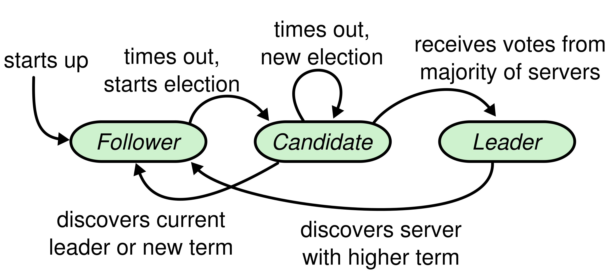

## [In Search of an Understandable Consensus Algorithm](https://www.usenix.org/system/files/conference/atc14/atc14-paper-ongaro.pdf)

Raft is a consensus algorithm for managing a replicated log.
It produces a result equivalent to multi-Paxos.

Raft separates the key elements of consensus, such as leader election, log replication and safty.
It enforces a stronger degree of conherency to reduce the number of states.

### Replcated State Machines

Consensus algorithms typically arise in the context of *replicated state machines*.

Replicated state machines are used to solve a varity of fault tolerance problems in distributed systems, e.g. GFS, HDFS and RAMCloud, mainly for managing leader election and storing configuration that must survive leader crashes.
Examples of replcated state machines include Chubby and ZooKeeper.

Replicated state machines are typically implemented using a replicated log. Keeping the replcated log consistent is the job of the consensus algorithm, which is to:

- ensure *safety* under all non-Byzantine conditions
- *available* as long as any majority of the servers operational
- do not depend on timing techniques
- *performant*, a minority of slow servers need not impact overall system performance

### Paxos

Paxos first defines a protocol capable of reaching agreement on a single decision, e.g. a single replicated log entry.
Paxos then combines multiple instances of this protocol to facilitate a series of decisions such as a log(Multi-Paxos).

### Design

Most important goal is *understandablity*.

### Raft

Raft implements consensus by first electing a distinguished *leader*.
The leader accepts log entries from clients, replicates them on other servers, and tells servers then it is safe to apply log entries to their state machines.

Raft includes:

1. leader election
1. log replication
1. safety

The key safety for Raft is the State Machine Safety Property:

1. Election Safety
2. Leader Append-Only
3. Log Matching
4. Leader Completeness
4. State Machine Safety

#### Raft Basics

A raft cluster contains several servers; **5** is a typical number, which allows the system to tolerate two failures.
At any time, each server is in one of the states:

1. leader
1. follower
1. candidate

Raft divides time into *terms* of arbitrary length.
Terms are numbered with consecutive integers.
Each term begins with an election.

Raft ensures that is at most one leader in a given term.

Terms act as a logical lock in Raft, which allow servers to detect obsolete information such as stale leaders.
Each server stores a *current terms* number, which increases **monotonically** over time.

Current terms are exchanged whenever servers communicate.
If a candidate or leader discovers that its term is out of date, it immediately reverts to follower state.
If a server receives a request with a stale term number, it rejects the request.

Raft servers communicate using RPCs, and the basic consensus algorithm requires:

1. RequestVote RPC, sent by candidates during elections
1. AppendEntries RPC, sent by leader to replicate log entry and to provide a form of heart beat

#### Leader Election

When servers start up, they begin as followers.
A server remains in follower state as long as it receives valid RPCs from a leader or candidate.
Leaders send periodic heartbeats to all followers in order to maintain their authority.

If a follower receives no communication over a period of time called the *election timeout*, then it assumes there is no viable leader and begins an election to choose a new leader.

To begin a election, a follower increments its current term and transitions to cnadidate state.
It then votes for itself and issues RequestVote RPCs in parallel to other servers.
A candidate continues in this state until:

1. wins the election
1. another server establishes itself as a leader
1. a period of time goes by but no winner

While waiting for votes, a candidate may receive an AppendEntires RPC from another server claiming to be leader.
If the leader's term is at least as large as the candidate's current term, then the candidate recognizes the leader as legitimate and returns to follower state.

Raft uses randomized election timeouts to ensure that split votes are rare and that they are resolved quickly.

#### Log Replication

Once a leader has been elected, it begins servicing client requests.

Each client request contains a command to be executed by the replicated state machines.
The leader appends the command to its log as a new entry, then issues AppendEntries RPCs in parallel to each of the other servers to replicate the entry.
Only if the entry is *safely* replicated, the leader applies the entry to its state and returns the result to the client.

Each log stores:

1. state machine command
1. term number given by leader
1. log index

If an entry is replicated on majority of machines, it is called *saftly replicated* or *committed*.
This also commits all proceding entries in the leader's log, including entries created by previous leaders.
Next subsection will discusses more about why it is safe.

The leader keeps track of the highest index it knows to be commited, which is also included in the AppendEntires RPCs.
Once a follower learns an entry is commited, it applies the entry in its local machine.

There are Log Matching Property:

1. If two entries in different logs have the same index and term, they store the same command.
1. If two entries in different logs have the same index and term, logs are indentical in all preceding entries.

By:

1. The leader creates at most one entry with a given log index in a given term.
1. When sending an AppendEntries RPC, the leader includes the index and term of the entry in its log immediately precedes the new entry.

Leader crashes can leave the logs inconsistent.
These inconsistencies can compound over a series of leader and follower crashes.

In Raft, the leader will force the follower's log to duplicate its own.
Next subsection will show why it is safe when coupled with one more restriction.

To bring a follower's log into consistency with its own, the leader must find the lastest log entry where the two logs agree, delete any entries in the follower's log after that and send all the leader's entries after that.

The leader maintains a *nextIndex* for each follower, which is the index of the next log entry the leader will send to that follower.
When a leader first comes to power, it initializes all nextIndex values to index just after the last one in log.
If a follower's log is inconsistent with the leader's, the AppendEntries RPC will fail and then the leader decrements nextIndex and retries the AppendEntries RPC.

#### Safety

This section completes the Raft algorithm by adding a restriction on which servers may be elected leader.
The restriction ensures that leader for any given term contains all of the entries commited in previous terms.

##### Election restriction

Raft uses the voting process to prevent a candidate from winning an election unless its log contains all committed entries.

A candidate must contact a majority of the cluster in order to be elected, which means that every committed entry must be present in at least one of those servers.

Raft determines which of two logs is more up-to-date by comparing the index and term of the last entries in the logs.

##### Committing entries from previous terms

If a leader crashes before committing an entry, future leaders will attempt to finish replicating the entry.
However, a leader cannot immediately conclude that an entry from a previous term is commited once it is stored on majority of servers. 

Raft never commits log entries from previous terms by counting replicas.
Only log entries from the leader's current term are commited by counting replicas.

Raft incurs this extra complexity in the commitment rules as log entries retain their original term numbers when a leader replicates entries from previous terms.

#### Timing and availability

$$
broadcastTime << electionTimeout << MTBF
$$

## Cluster Membership Changes

Switching directly from one configuration to another is unsafe because different servers will switch at different times.

简单总结：

1. 分布式一致性协议是用来保持分布式日志的一致性的；日志中的记录是状态机的命令，如果分布式日志是一致的，那么按照日志运行的状态机必定一致。
1. Raft是一种分布式一致性协议，相比于Paxos更易于理解。
1. Raft中定义机器可能在三种状态中的一种：Leader, Candidate, Follower。
1. Raft中的Term是时间度量的单位，从0开始，单调递增；每个Term最多有一个Leader。
1. 每次Election都会产生一个新的Term。
1. Raft只有以下RPC:
	a. RequestVote
	b. AppendEntries